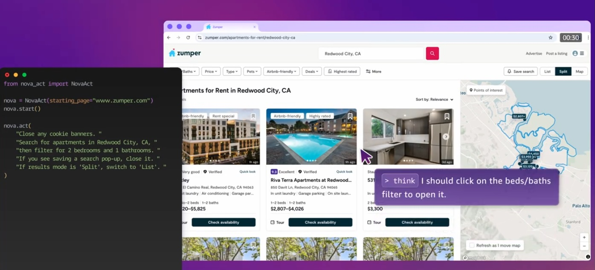

# Building Agents with Amazon Nova Act and MCP

This repository demonstrates how to build intelligent web automation agents using Amazon Nova Act integrated with MCP (Model Context Protocol). MCP provides a standardized way to connect AI models to different data sources and tools - think of it like a "USB-C port for AI applications."



## Overview

This project showcases the integration between:

- **Amazon Nova Act**: A powerful web automation tool for creating agents that interact with web pages
- **MCP (Model Context Protocol)**: An open protocol that standardizes how applications provide context to LLMs
- **Amazon Bedrock**: Managed service that provides foundation models through a unified API

### Architecture

The project follows MCP's client-server architecture:

- **MCP Host**: Claude Desktop or other AI tools that want to access Nova Act capabilities
- **MCP Client**: Protocol clients maintaining 1:1 connections with the Nova Act server
- **MCP Server**: A Nova Act server exposing web automation capabilities through the standardized protocol
- **Remote Services**: Web services that Nova Act interacts with through browser automation

### Key Features

- Standardized LLM integration through MCP
- Automated web navigation and interaction via Nova Act
- Parallel execution of multiple browser tasks
- Data extraction and processing
- Screenshot capture and visual verification
- Session management and browser control
- Seamless integration with Claude Desktop
- Access to foundation models via Amazon Bedrock

## Prerequisites

- Operating System: MacOS or Ubuntu (Nova Act requirements)
- Python 3.10 or higher
- A valid Nova Act API key (obtain from https://nova.amazon.com/act)
- Node.js (for Claude Desktop integration)
- Amazon Bedrock access:
  - [Amazon Bedrock enabled in your AWS account](https://docs.aws.amazon.com/bedrock/latest/userguide/getting-started.html)
  - Claude 3.5 Sonnet V2 model enabled (this is default for this example)
  - AWS credentials and region properly configured - [AWS CLI Quickstart Guide](https://docs.aws.amazon.com/cli/latest/userguide/getting-started-quickstart.html)

## Project Structure

The repository contains two main example directories:

### 1. Streamlit Examples (`streamlit_examples/`)
- `video_game_research_st.py`: A comprehensive tool that:
  - Finds top games for any selected gaming system
  - Searches Amazon in parallel for pricing and details
  - Creates interactive result tables
  - Saves research data for future reference

### 2. MCP Examples (`mcp_examples/`)
- `nova_act_mcp_server.py`: MCP-compliant server implementation exposing Nova Act capabilities
- `nova_act_mcp_client.py`: Example MCP client implementation
- Demonstrates integration with Claude Desktop and other MCP hosts

## Getting Started

1. Clone this repository

2. Install dependencies:
   ```bash
   pip install -r requirements.txt
   ```

3. Set your Nova Act API key:
   ```bash
   export NOVA_ACT_API_KEY="your_api_key"
   ```

4. Make sure your environment has AWS configured correctly - https://docs.aws.amazon.com/cli/latest/userguide/getting-started-quickstart.html

## Usage

### Running Streamlit Examples
```bash
cd streamlit_examples
streamlit run video_game_research_st.py
```

### Running the MCP Server and Client
```bash
cd mcp_examples
python nova_act_mcp_client.py nova_act_mcp_server.py
```

The command above will:
1. Start the MCP server that exposes Nova Act capabilities
2. Launch the MCP client that connects to the server
3. Enable communication between Claude and the Nova Act browser automation

### Claude Desktop Integration

For setting up and using this server with Claude Desktop, please follow the official [Claude Desktop MCP Setup Guide](https://modelcontextprotocol.io/quickstart/user). The guide covers:

- Installing and configuring Claude Desktop
- Setting up MCP servers in Claude Desktop
- Troubleshooting common issues
- Example usage and best practices

## Best Practices

1. Follow MCP's standardized approach for exposing capabilities
2. Always close browser sessions when done
3. Use headless mode for automated tasks not requiring visual feedback
4. Break down complex actions into smaller, specific instructions
5. Use schemas when expecting structured data responses
6. Save important results to files for persistence
7. Handle errors appropriately in your code

## Security

See [CONTRIBUTING](CONTRIBUTING.md#security-issue-notifications) for more information.

## License

This library is licensed under the MIT-0 License. See the LICENSE file.

## Additional Resources

- [MCP Documentation](https://modelcontextprotocol.io/introduction)
- [Nova Act Documentation](https://nova.amazon.com/act)
- [Amazon Bedrock Documentation](https://docs.aws.amazon.com/bedrock/)